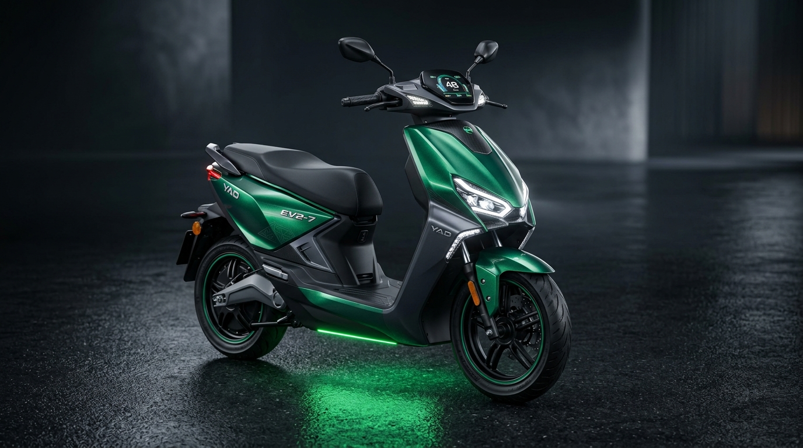

# YAD Auto Industries (Pvt.) Ltd. — Official EV Manufacturer Website



> **Pakistan's Leading Manufacturer of Electric Bikes and Commercial EVs.**  
> 100% Environment Friendly · Zero Emissions · Save up to 85% on Daily Commute

---

## 🛵 Vehicle Lineup

| Model | Category | Motor Power | Top Speed | Battery Chemistry | Battery Specs | Est. Range |
|---|---|---|---|---|---|---|
| **YAD EV2-7** | Flagship Sport EV | 3,000 W | 130 km/h | Lithium (LiFePO4) | 60V – 50AH | 110 – 130 km |
| **YAD EV2-6** | Long Range Cruiser | 1,200 W | 65 km/h | Graphene Thermal-Max | 72V – 32AH | 90 – 110 km |
| **YAD EV2-4** | Smart City Scooty | 500 W | 50 km/h | Graphene Thermal-Max | 60V – 32AH | 80 – 95 km |
| **YAD EV2-1** | Lightweight Urban | 350 W | 40 km/h | Graphene Thermal-Max | 48V – 14AH | 45 – 60 km |
| **YAD EV3-3 Pro** | Commercial Loader | 1,000 W | 50 km/h | Graphene Fleet Pack | 72V – 45AH | 80 – 100 km (650kg payload) |

---

## 🚀 Key Website Features

- 🎨 **Interactive 360° Studio & Color Customizer**: Switch models and exterior shades with live HUD spec telemetry and electric motor sound simulation.
- 💰 **Petrol vs. EV Savings Calculator**: Real-time PKR slider showing daily commute cost savings (saving up to Rs. 15,000–25,000+ per month).
- 📋 **Full Specifications Comparison Matrix**: Side-by-side technical comparison table across all EV2 models.
- 🛵 **Instant Test Ride Booking Modal**: Online booking with city and showroom selection across Pakistan.
- 💼 **Dealership & Franchise Proposal Form**: Partner application form for nationwide franchise applicants.
- 🔋 **Battery Tech Deep Dive**: Graphene & LiFePO4 thermal resilience up to 55°C ambient temperatures.
- 🏭 **Made in Pakistan Factory Showcase**: 91-B Sunder Small Industrial Estate, Lahore assembly plant.
- 📍 **Nationwide Dealer Directory**: Locations across Lahore, Karachi, Islamabad/Rawalpindi, Faisalabad, Multan, and Peshawar.
- 💬 **Live WhatsApp Floating Quick Chat Widget**.

---

## 💻 Tech Stack & Architecture

- **Frontend**: Pure Semantic HTML5, Vanilla CSS3 (Custom Design System, Glassmorphism, CSS Grid, Responsive Flexbox), Vanilla Modern JavaScript (ES6+).
- **Zero Dependencies**: Fast load times, SEO optimized, and fully responsive across mobile, tablet, and desktop screens.
- **Built-in Server**: Zero-dependency `server.js` included.

---

## 🏃 Quick Start (Run Locally)

### Option 1: Using Built-in Node.js Server
```bash
node server.js
```
Open **[http://localhost:3000](http://localhost:3000)** in your browser.

### Option 2: Direct File Open
Simply double-click `index.html` to open it directly in any modern browser.

---

## 🏢 Locations

- **Head Office**: Mohalla Tariq Abad, Main Multan Road Bypass, Manga Mandi, Lahore, Pakistan
- **Manufacturing Plant**: 91-B Sunder Small Industrial Estate, Lahore, Pakistan
- **Official Domain**: [yadpk.com](https://yadpk.com)

---

© 2025 YAD Auto Industries (Pvt.) Ltd. — All Rights Reserved · Lahore, Pakistan
